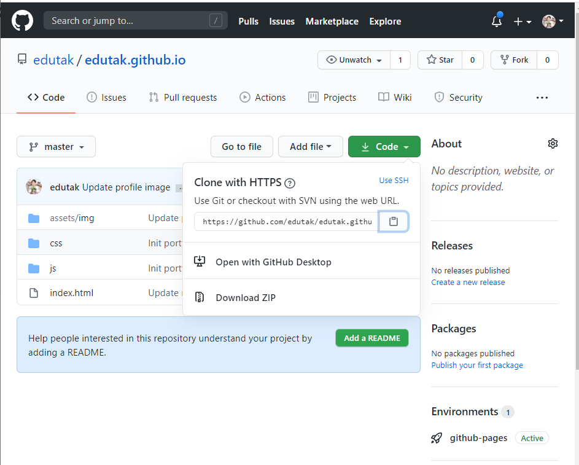

# 집에서 복습 시작하는 숙제

## 0. 설치

* git bash
* typora
* 선택) visual studio code

## 1. 프로젝트 복제

> 개인이 작성한 username.github.io 프로젝트



```bash
$ git clone https://~~~~~~~~~~~~~~~~~~
```

## 2. 폴더 내에 README.md 만들기

> 선택 : html 파일을 꾸며도 됩니다.

* 만드는 / 수정 작업을 완료한 이후에 

  ```bash
  $ git status
  $ git add .
  $ git commit -m '집!'
  $ git push origin master
  ```

## 3. github 저장소(repository)에서 결과 보기


# 실패하면...

## 아무 저장소 만들어서 github 저장소에 push하기


